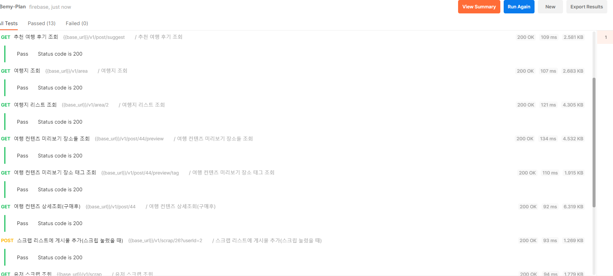

# Bemyplan-Server  
### 내 취향에 맞는 여행 서비스, Be My Plan


> SOPT 29th APPJAM </b>
>
> 프로젝트 기간: 2022.01.02 ~ 2022.01.22

### API DOCS
[be-my-plan-api-docs](https://wood-sandpaper-707.notion.site/API-bca655150dce4eb8bed070a4cad8c3df)

### Development Environment   
       

### Branch Strategy

github flow 사용


| Branch Name | 설명 |
| :---: | :-----: |
| main | 초기 세팅 존재 |
| feature | 새로운 기능 추가 |
| refactor | 리펙터링 관련 |
| fix | 버그 수정 |

### Commit Convention
#### TAG: 메시지 

| 태그 이름  |                             설명                             |
| :--------: | :----------------------------------------------------------: |
|  [CHORE]   |                  코드 수정, 내부 파일 수정                   |
|   [FEAT]   |                       새로운 기능 구현                       |
|   [FIX]    |                       버그, 오류 해결                        |
|   [DOCS]   |                 README나 WIKI 등의 문서 개정                 |
| [REFACTOR] |                   전면 수정이 있을 때 사용                   |

### Coding Convention
[Node-style-guide](https://github.com/felixge/node-style-guide)

[airbnb-javascript-guide](https://github.com/airbnb/javascript)


### ERD


### Dependency
```
functions
├── @slack/web-api@6.6.0
├── busboy@1.3.0
├── cookie-parser@1.4.6
├── cors@2.8.5
├── cross-env@7.0.3
├── dayjs@1.10.7
├── dotenv@10.0.0
├── eslint-config-google@0.14.0
├── eslint-config-prettier@8.3.0
├── eslint@7.32.0
├── express@4.17.2
├── firebase-admin@9.12.0
├── firebase-functions-test@0.2.3 
├── firebase-functions@3.16.0
├── firebase@9.6.2
├── helmet@5.0.1
├── hpp@0.2.3
├── jsonwebtoken@8.5.1
├── lodash@4.17.21
├── lru_map@0.3.3 extraneous
├── pg-hstore@2.3.4
├── pg@8.7.1
├── request-promise@4.2.6
├── request@2.88.2
├── @sentry/core@6.16.1 extraneous
├── @sentry/hub@6.16.1 extraneous
├── @sentry/minimal@6.16.1 extraneous
├── @sentry/node@6.16.1 extraneous
├── @sentry/tracing@6.16.1 extraneous
├── @sentry/types@6.16.1 extraneous
├── @sentry/utils@6.16.1 extraneous
└── sequelize@6.13.0
```

### Test


### folding project / 프로젝트 폴더링

```
bemyplan_server
|
|- .github
|
|- functions
      |
      |- api
          |- routes
      |- config
      |- constants
      |- contorller
      |- loaders
      |- models
      |- service
      |- lib
      |- db
      |- utils
      |- images
```

### Developers

|이름|GitHub|
|---|---|
|안준영|[@junyoii](https://github.com/junyoii)|
|이제준|[@LeeJejune](https://github.com/LeeJejune)|
|김보배|[@KimDoubleB](https://github.com/KimDoubleB)|


